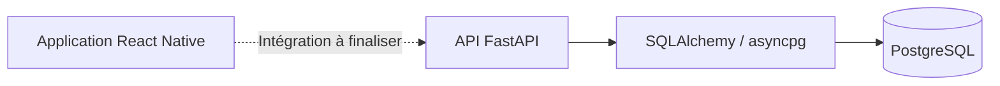

<div align="center">

# 🎬 Pandora

**Trouver le prochain film ou la prochaine série qui te correspond.**

Projet d’application mobile de recommandations personnalisées pour les passionnés de cinéma et de séries.


[Présentation](#-présentation) · [État du projet](#-état-du-projet) · [Installation](#-installation) · [API](#-api) · [Feuille de route](#-feuille-de-route)

</div>

---

## 🍿 Présentation

Face à des catalogues de streaming toujours plus vastes, choisir quoi regarder peut devenir une recherche à part entière. **Pandora** vise à faciliter cette découverte en proposant des films et des séries adaptés aux goûts de chaque utilisateur.

La vision du projet repose sur l’analyse des préférences et, à terme, sur un moteur de recommandation utilisant le machine learning. Le dépôt contient aujourd’hui les premières briques : une interface mobile, une API de gestion des utilisateurs et une base de données PostgreSQL.

> **Projet en cours de développement.** Le catalogue, les intégrations avec les plateformes de streaming et les recommandations personnalisées ne sont pas encore implémentés.

La [fiche projet](Fiche_Projet.pdf) présente l’idée initiale, les objectifs et l’organisation de l’équipe. La stack a évolué depuis ce document : le backend présent dans ce dépôt utilise **FastAPI et PostgreSQL**.

## ✨ État du projet

| Fonctionnalité | État actuel |
| --- | --- |
| Interface mobile | Écrans de connexion et d’inscription avec navigation React Navigation |
| Inscription | Formulaire présent ; URL de l’API à aligner avant utilisation |
| Connexion mobile | Simulation locale ; branchement à l’API à réaliser |
| Gestion des utilisateurs | Routes API de création, lecture, modification et suppression présentes |
| Authentification API | Vérification du mot de passe avec bcrypt et émission d’un JWT de 30 minutes |
| Persistance | PostgreSQL avec SQLAlchemy asynchrone et asyncpg |
| Documentation API | Swagger UI et ReDoc exposés par FastAPI |
| Environnement Docker | API et base de données configurées dans Docker Compose |
| Catalogue et recommandations | À développer |

## 🛠️ Stack technique

| Couche | Technologies présentes |
| --- | --- |
| Application mobile | React Native 0.75.4, React 18.3.1, TypeScript 5.0.4 |
| Navigation et interface | React Navigation, composants React Native, police Poppins |
| Communication HTTP | API `fetch` côté mobile |
| Backend | Python 3.11 dans Docker, FastAPI, Uvicorn, Pydantic |
| Données | PostgreSQL 15, SQLAlchemy, asyncpg |
| Authentification | Passlib / bcrypt, PyJWT |
| Outils | Docker Compose, ESLint, Prettier, Jest |

## 🧭 Architecture



L’API expose ses routes métier sous `/api/v1`. Les tables sont créées au démarrage à partir des modèles SQLAlchemy. Le client mobile se lance séparément ; son service Docker est actuellement commenté dans le fichier Compose.

## 🚀 Installation

### Prérequis

- **Git**, **Docker** et **Docker Compose** pour récupérer le projet et démarrer le backend.
- **Node.js ≥ 18**, conformément au `package.json`, et **npm** pour le client.
- Un environnement React Native natif configuré : Android Studio, SDK et émulateur pour Android, ou macOS avec Xcode et CocoaPods pour iOS.

La configuration Android du dépôt cible le **SDK 34**. Python et PostgreSQL sont fournis par les conteneurs pour le parcours ci-dessous.

### 1. Démarrer l’API et la base de données

Depuis la racine du dépôt :

```bash
docker compose up --build -d
```

| Service | Adresse locale |
| --- | --- |
| État de l’API | http://localhost:8000/health |
| Swagger UI | http://localhost:8000/docs |
| ReDoc | http://localhost:8000/redoc |

Pour vérifier le démarrage :

```bash
docker compose logs -f fastapi-backend
curl http://localhost:8000/health
```

Réponse attendue lorsque l’API est démarrée :

```json
{"status":"healthy"}
```

Si PostgreSQL n’était pas encore prêt lors du premier lancement de l’API, relance le backend après le démarrage de la base :

```bash
docker compose restart fastapi-backend
```

### 2. Préparer le client mobile

```bash
cd client
npm install
```

L’URL d’inscription dans [`client/src/services/api.tsx`](client/src/services/api.tsx) utilise actuellement `/users/`, alors que le backend expose `/api/v1/users/`. Avant de tester l’inscription sur l’émulateur Android, remplace cette URL par :

```text
http://10.0.2.2:8000/api/v1/users/
```

Adapte également l’hôte à ton environnement si tu utilises un appareil physique ou un autre simulateur. Le formulaire de connexion reste une simulation locale tant qu’il n’est pas relié à `POST /api/v1/auth`.

### 3. Lancer l’application

Dans un terminal, depuis `client/`, démarre Metro :

```bash
npm start
```

Dans un second terminal, toujours depuis `client/` :

```bash
npm run android
```

Pour iOS, sur macOS avec l’environnement natif configuré, installe d’abord les dépendances CocoaPods depuis `client/` :

```bash
bundle install
cd ios
bundle exec pod install
cd ..
npm run ios
```

### Arrêter les services

Depuis la racine du dépôt :

```bash
docker compose down
```

Les données PostgreSQL restent conservées dans le volume `postgres_data`.

## 🔌 API

| Méthode | Route | Fonction |
| --- | --- | --- |
| `GET` | `/health` | Vérifier que l’API répond |
| `POST` | `/api/v1/auth` | Authentifier un utilisateur et obtenir un JWT |
| `POST` | `/api/v1/users/` | Créer un utilisateur |
| `GET` | `/api/v1/users/` | Lister les utilisateurs |
| `GET` | `/api/v1/users/{user_id}` | Consulter un utilisateur |
| `PUT` | `/api/v1/users/{user_id}` | Modifier un utilisateur |
| `DELETE` | `/api/v1/users/{user_id}` | Supprimer un utilisateur |

### Exemple d’inscription

```bash
curl -X POST http://localhost:8000/api/v1/users/ \
  -H 'Content-Type: application/json' \
  -d '{
    "first_name": "Alex",
    "last_name": "Martin",
    "email": "alex@example.com",
    "password": "ExempleLocal123!"
  }'
```

### Exemple de connexion

```bash
curl -X POST http://localhost:8000/api/v1/auth \
  -H 'Content-Type: application/json' \
  -d '{
    "email": "alex@example.com",
    "password": "ExempleLocal123!"
  }'
```

La réponse de connexion contient un champ `message` et le JWT dans `data`.

## 🗂️ Structure du dépôt

```text
Pandora/
├── client/
│   ├── App.tsx                 # Navigation principale
│   ├── src/
│   │   ├── components/         # Formulaires de connexion et d’inscription
│   │   ├── screens/            # Écrans de l’application
│   │   ├── services/           # Appels HTTP
│   │   ├── styles/             # Styles partagés
│   │   └── assets/             # Polices
│   ├── android/                # Projet natif Android
│   ├── ios/                    # Projet natif iOS
│   └── package.json
├── server/
│   ├── main.py                 # Application FastAPI et démarrage
│   ├── api/endpoints/          # Routes utilisateurs et authentification
│   ├── core/                   # Hachage des mots de passe et JWT
│   ├── db/                     # Connexion et sessions PostgreSQL
│   ├── models/                 # Modèles SQLAlchemy
│   ├── schemas/                # Schémas Pydantic
│   ├── services/               # Logique métier
│   ├── Dockerfile
│   └── requirements.txt
├── docker-compose.yml
├── Fiche_Projet.pdf
└── README.md
```

## 🧪 Développement

Les commandes suivantes sont définies dans le client :

```bash
cd client
npm run lint
npm test
```

Le backend ne contient pas encore de suite de tests dédiée. Swagger UI permet d’explorer les routes et de réaliser les premiers essais manuels.

### Points à finaliser dans le prototype

- Aligner l’URL d’inscription mobile sur le préfixe `/api/v1` et connecter le formulaire de connexion à l’API.
- Corriger le champ « Nom », actuellement lié à la valeur du prénom, et décider du stockage du numéro de téléphone, absent du modèle backend.
- Corriger la mise à jour du mot de passe : le service affecte `password_hash`, alors que le modèle utilise `hashed_password`.
- Ajouter la vérification des JWT et les autorisations aux routes utilisateurs, actuellement sans contrôle d’accès.
- Retirer `hashed_password` des réponses API et externaliser la clé JWT ainsi que les identifiants de base de données, actuellement définis dans le code et Compose.
- Fixer les versions des dépendances Python pour rendre l’installation reproductible.

Ces éléments décrivent l’état du dépôt ; l’authentification et le parcours mobile complet restent à consolider avant une mise en production.

## 🗺️ Feuille de route

Les prochaines étapes issues de la vision du projet sont :

- [ ] Finaliser le parcours d’inscription et de connexion.
- [ ] Permettre aux utilisateurs de renseigner leurs préférences.
- [ ] Intégrer une source de données pour les films et séries.
- [ ] Développer puis évaluer un moteur de recommandation personnalisé.
- [ ] Afficher les suggestions dans l’application mobile.
- [ ] Ajouter des tests d’intégration et automatiser la validation du projet.

## 👥 Équipe

Rôles indiqués dans la fiche projet :

| Membre | Rôle |
| --- | --- |
| `london_j` | Chef de projet et développement full stack |
| `bouzia_b` | Développement frontend et UX/UI |
| `elyazi_i` | Développement backend |
| `aubry_c` | Data science et machine learning |
| `coskun_h` | DevOps et environnements Docker |

---

<div align="center">

**Pandora** · Une application en construction pour découvrir quoi regarder ensuite.

</div>
